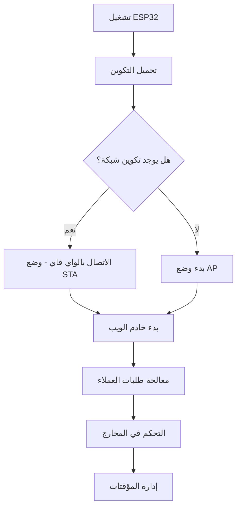

# نظام التحكم في الغسالات الصناعية باستخدام ESP32


## مقدمة
هذا المشروع يقدم نظام تحكم متكامل للغسالات الصناعية باستخدام متحكم ESP32، مع واجهة ويب تفاعلية باللغة العربية تدعم كلاً من وضعي اتصال Wi-Fi (STA وAP). النظام يوفر تحكمًا دقيقًا في المخارج الكهربائية، إدارة زمنية متقدمة، وتخزين إعدادات الشبكة والتكوينات في ذاكرة SPIFFS الداخلية.

## ✨ الميزات الرئيسية

- **دعم ثنائي لشبكة الواي فاي**:
  - **وضع STA**: الاتصال بشبكات الواي فاي الموجودة
  - **وضع AP**: إنشاء نقطة وصول عند عدم وجود شبكات متاحة
- **التحكم في المخارج**:
  - مخرجان تبادليان مع تحكم زمني متقدم
  - 10 مخارج يدوية مع مؤقت إغلاق تلقائي قابل للتعديل
- **المصادقة والأمان**:
  - مصادقة أساسية HTTP (admin/admin)
  - حماية صفحات الإعدادات الحساسة
- **تخزين SPIFFS**:
  - تخزين قوالب HTML، CSS، JS والخطوط
  - ملفات تكوين لإعدادات الشبكة والنظام
- **واجهة ويب تفاعلية**:
  - دعم اللغة العربية والاتجاه RTL
  - وضع ليلي/نهاري
  - تحديثات في الوقت الحقيقي
- **دعم mDNS**: الوصول عبر `http://esp32-control.local`
- **إدارة الملفات**: رفع وتنزيل الملفات من/إلى SPIFFS

## 🧩 التكوين المادي

### المخارج الكهربائية
```c
#define TOGGLE_OUT1 17   // المخرج التبادلي 1
#define TOGGLE_OUT2 16   // المخرج التبادلي 2
#define MANUAL_OUT1 18   // المخرج اليدوي 1
#define MANUAL_OUT2 19   // المخرج اليدوي 2
// ... حتى MANUAL_OUT10 33
```

### أسماء المخارج الافتراضية
```c
const char* toggleOutputNames[] = { "دوران يمين", "دوران يسار" };
const char* manualOutputs[] = {
  "فتح الباب", "إغلاق الباب", "تعبئة ماء",
  "فتح بخار", "مكب تصريف", "إغلاق تصريف",
  // ... حتى المخرج اليدوي 10
};
```

## 🌐 أوضاع الشبكة

### وضع STA (عميل)
- الاتصال بشبكات واي فاي محددة مسبقًا
- دعم حتى 5 شبكات مع أولويات
- خيار تكوين IP ثابت
- إعادة اتصال تلقائي

### وضع AP (نقطة وصول)
- SSID: `ESP32-Control`
- كلمة المرور: `12345678`
- IP: `192.168.4.1`
- وضع احتياطي عند عدم توفر شبكات

## 📂 هيكل نظام الملفات SPIFFS

| المسار          | المحتويات                             |
|-----------------|---------------------------------------|
| `/`             | قوالب HTML (index, config)            |
| `/css/`         | ملفات التنسيق (main, config, fonts)   |
| `/js/`          | ملفات جافاسكريبت (main, config)       |
| `/fonts/`       | خطوط الويب (Cairo, Tajawal)           |
| `/webfonts/`    | أيقونات Font Awesome                  |

### ملفات التكوين
- `wifi_config.bin`: إعدادات شبكات الواي فاي
- `system_settings.bin`: إعدادات المؤقتات والنظام

## ⚙️ آلية عمل النظام

### المخارج التبادلية
- فاصل زمني قابل للضبط (5-300 ثانية)
- مدة تشغيل كلية (1-120 دقيقة)
- زمن استراحة بين التبديلات (0-10 ثواني)
- تتبع التقدم في الوقت الحقيقي

### المخارج اليدوية
- مؤقتات إغلاق تلقائي فردية (0-300 ثانية)
- منطق خاص لازدواج المخارج 1-2 و5-6
- عرض الوقت المتبقي

## 🌐 صفحات واجهة الويب

### 1. لوحة التحكم الرئيسية (`/`)

- حالة المخارج في الوقت الحقيقي
- عناصر تحكم بتشغيل النظام
- شريط التقدم والموقتات
- لوحة إعدادات قابلة للطي

### 2. تكوين الشبكة (`/config`)

- إضافة/إزالة شبكات واي فاي
- تكوين IP ثابت
- إدارة الأولويات
- خيارات الإعادة الضبط

### 3. حالة الشبكة (`/networkstatus`)

- وضع الاتصال الحالي
- عنوان IP والبواية
- معلومات القناع

### 4. إدارة الملفات (`/uploadfile`)

- رفع الملفات إلى SPIFFS
- تنزيل ملفات التكوين
- قيود على أنواع الملفات

### 5. مراقبة السيريال (`/serial`)

- عرض ناتج السيريال لـ ESP32
- وظائف التحديث والمسح
- سعة تخزين 50 رسالة

## 🔒 نظام المصادقة
- **اسم المستخدم**: `admin`
- **كلمة المرور**: `admin`
- الصفحات المحمية:
  - صفحات التكوين
  - إدارة الملفات
  - إعدادات النظام
  - مراقبة السيريال

## 📚 المكتبات المستخدمة

| المكتبة         | الغرض                                |
|-----------------|--------------------------------------|
| `WiFi`          | اتصال الواي فاي                     |
| `WebServer`     | تنفيذ خادم HTTP                     |
| `SPIFFS`        | نظام تخزين الملفات                   |
| `Update`        | تحديثات البرنامج لاسلكياً (OTA)     |
| `ESPmDNS`       | خدمة اكتشاف mDNS                    |
| `ArduinoJson`   | معالجة بيانات JSON                  |
| `FreeRTOS`      | تعدد المهام وإدارة النوى            |

## 🚀 بدء الاستخدام

1. **رفع بيانات SPIFFS**:
   - استخدم أداة ESP32 Sketch Data Upload
   - أو الرفع عبر واجهة الويب

2. **التكوين الأولي**:
   - اتصل بنقطة الوصول `ESP32-Control`
   - انتقل إلى `http://192.168.4.1/config`
   - قم بتكوين شبكات الواي فاي

3. **الوصول إلى لوحة التحكم**:
   - اتصل بالشبكة المكونة
   - الوصول عبر `http://esp32-control.local` أو عنوان IP الجهاز
   - سجل الدخول باستخدام بيانات admin

## 🧪 اختبار أوامر السيريال
- اضغط `C` في مراقب السيريال لإنشاء تكوين واي فاي افتراضي
- استخدم نقطة النهاية `debug?msg=رسالة` لاختبار ناتج السيريال

## ⚠️ ملاحظات هامة
- المخارج اليدوية 1-2 لها منطق ازدواج خاص
- المخارج التبادلية تعطل التحكم اليدوي عند التنشيط
- تغييرات التكوين تتطلب إعادة تشغيل ESP32
- مساحة تخزين SPIFFS محدودة (1.5MB عادةً)

## 🔄 تدفق عمل النظام


## 📁 هيكل ملفات المشروع
- `ESP32_Webserver_STA_AP_SPIFFS.ino` - الكود الرئيسي
- `index.html` - واجهة التحكم الرئيسية
- `config.html` - تكوين الشبكة
- `network.html` - حالة الشبكة
- `upload.html` - إدارة الملفات
- `config.js` - منطق صفحة التكوين
- `main.js` - منطق واجهة التحكم
- ملفات CSS في مجلد `/css/`

data/
  ├── index.html
  ├── config.html
  |-- network.html
  |-- upload.html
  ├── css/
  │    ├── base.css
  │    ├── config.css
  │    ├── upload.css
  │    ├── config.css
  │    ├── network.css
  │    ├── index.css
  │    ├── all.min.css
  │    ├── cairo.css
  │    └── tajawal.css
  ├── js/
  │    ├── main.js
  │    └── config.js
  ├── fonts/
  │    ├── Cairo-SemiBold.woff2
  │    └── Tajawal-Regular.woff2
  └── webfonts/
       ├── fa-solid-900.woff2
       ├── fa-v4compatibility.woff2
       ├── fa-regular-400.woff2
       └── fa-brands-400.woff2

## 💡 نصائح الاستخدام
- استخدم الإعدادات المسبقة لملفات التوقيت الشائعة
- تفعيل الوضع الليلي لتقليل إجهاد العين
- احتفظ بنسخ احتياطية منتظمة لملفات التكوين
- راقب ناتج السيريال لتصحيح الأخطاء
- استخدم اسم mDNS للوصول الموثوق

## 📜 الترخيص
هذا المشروع مرخص تحت رخصة MIT - انظر ملف [LICENSE](LICENSE) للتفاصيل.